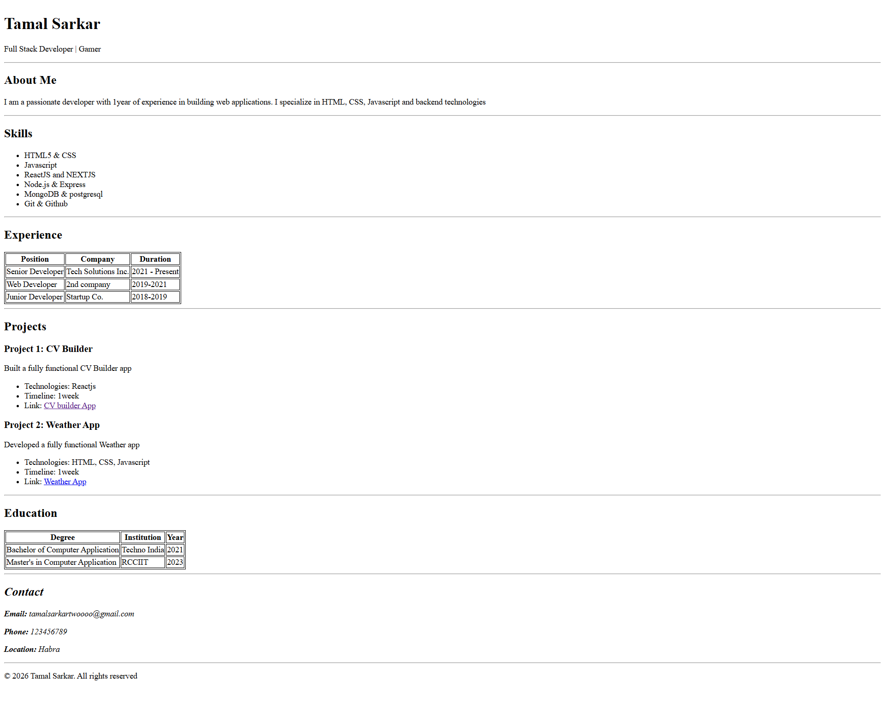

# ChaiCode WEB-DEV-2026 HTML Resume Website 

A single-page resume website built using **pure HTML**, following proper semantic structure and clean layout guidelines.  
This project was created as part of a Web Development HTML assignment of ChaiCode WEB-DEV-2026.

---

## Project Overview

The goal of this project is to build a clean and readable resume website using **only HTML** (no CSS), while maintaining:

- Proper HTML semantics
- Clear content hierarchy
- Structured layout using sections, tables, and lists

The resume includes:
- Header / Name section
- About Me
- Skills list
- Experience table
- Projects section
- Education table
- Contact details

---

## Expected Result

Live at: https://kardt89.github.io/HTML-Resume-Page-Assignment/

